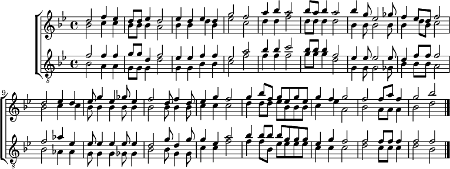

# Procedural Music Generator

This repository contains a procedural music generator developed as part of a master's thesis at NTNU. The program generates tonal melodies from configurable musical settings and can also produce simple four-part harmonizations.



## Quick start

```bash
python3 code/main.py --form sentence --pdf --wav
```

This generates a melody with a sentence-like form and optionally renders notation and audio.

## What the program does

The current generator supports:

- tonal melody generation in different keys and modes
- form-aware generation with `auto`, `sentence`, `period`, and `phrase`
- automatic or explicit harmonic plans
- rhythmic restriction through configurable allowed durations
- different voice profiles and ranges
- melody-only or chorale-style output
- LilyPond export, with optional PDF and WAV rendering

The system is built around an object-oriented music model and a weighted soft-constraint approach. In practice, this means the generator creates candidate melodies and prefers the ones that better satisfy musical rules such as stepwise motion, cadence shaping, chord-tone preference, and motivic reuse.

## At a glance

| Area | Support |
|---|---|
| Keys and modes | Major, minor, and modal tonal settings |
| Form | `auto`, `sentence`, `period`, `phrase` |
| Harmony | Automatic or explicit beat-based plans |
| Texture | Single melody or chorale-style output |
| Rendering | LilyPond source, cropped PDF, WAV |
| Control surface | CLI with reusable configuration in `code/main.py` |

## Repository layout

- `code/` – the music generator and CLI
- `docs/` – user-facing program documentation
- `thesis/` – thesis source, figures, and example material
- `webpage/` – archive-page builder for generated thesis examples

## Basic usage

Run the generator from the repository root:

```bash
python3 code/main.py
```

Common examples:

```bash
python3 code/main.py --key D --mode major --bars 8 --seed 1337
python3 code/main.py --form sentence --pdf --wav
python3 code/main.py --texture chorale --key Eb --bars 8 --seed 2000 --pdf --wav
python3 code/main.py --harmony "2I,2V,4I,2IV,2iv" --seed 3000 --pdf
python3 code/main.py render --seed 1337 --pdf --wav
```

Generated LilyPond files are written to `code/output/<seed>/` by default. Optional rendering uses LilyPond for notation output and TiMidity++ for WAV export.

## How it is structured

- [code/main.py](code/main.py) defines the default project configuration, especially the soft-constraint weights.
- [code/app_cli.py](code/app_cli.py) contains the reusable command-line workflow.
- `code/melody_engine/` contains the musical data structures, generator logic, harmonization logic, and export pipeline.

This makes it possible to keep the CLI stable while still experimenting with different generator settings in `main.py`.

## Documentation and thesis

- Program documentation: [docs/_build/html/index.html](docs/_build/html/index.html)
- Thesis PDF: [thesis/latex/main.pdf](thesis/latex/main.pdf)

Author-specific workflow notes for thesis building, archive generation, and deployment are kept in [thesis/README.md](thesis/README.md).
